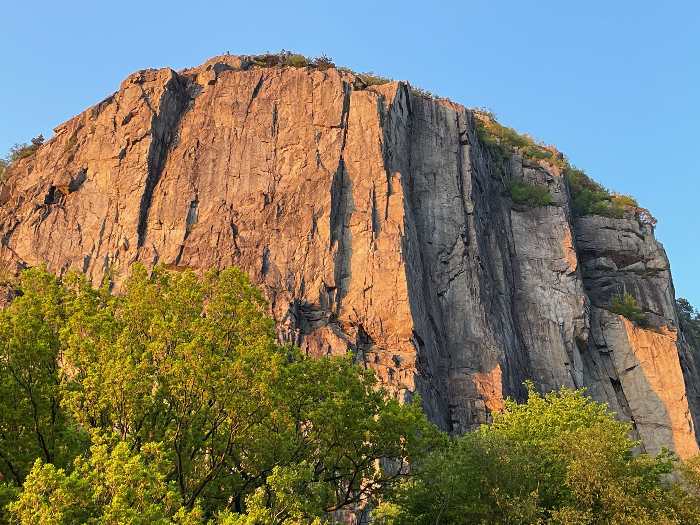
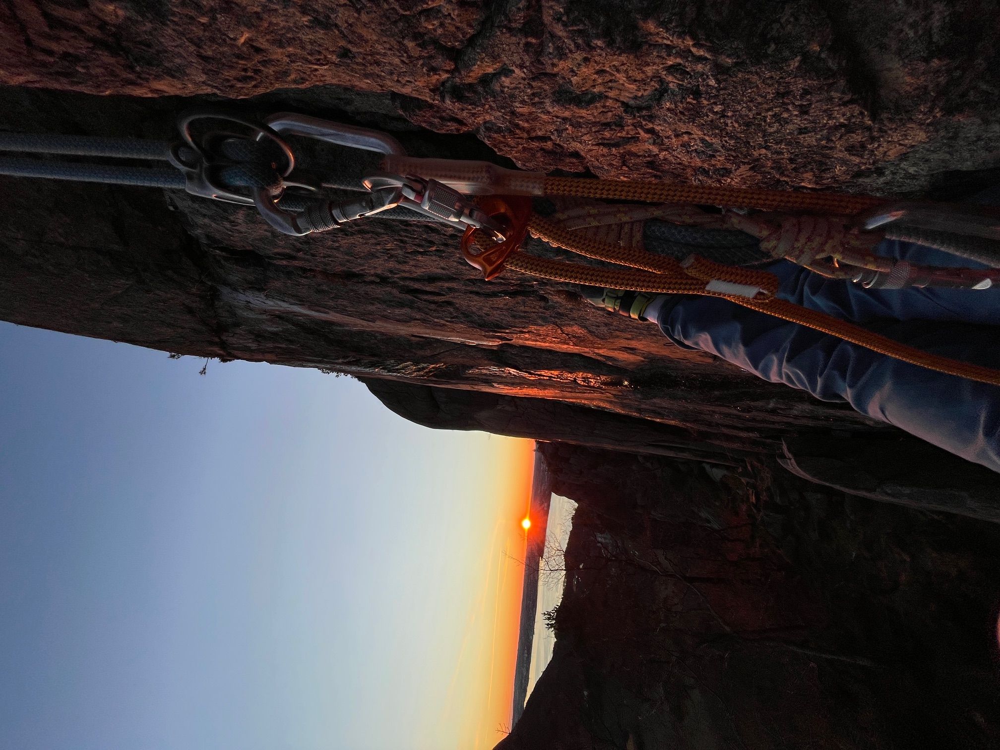
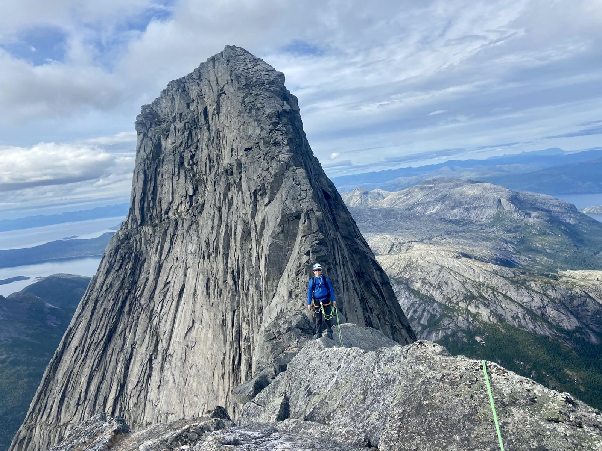
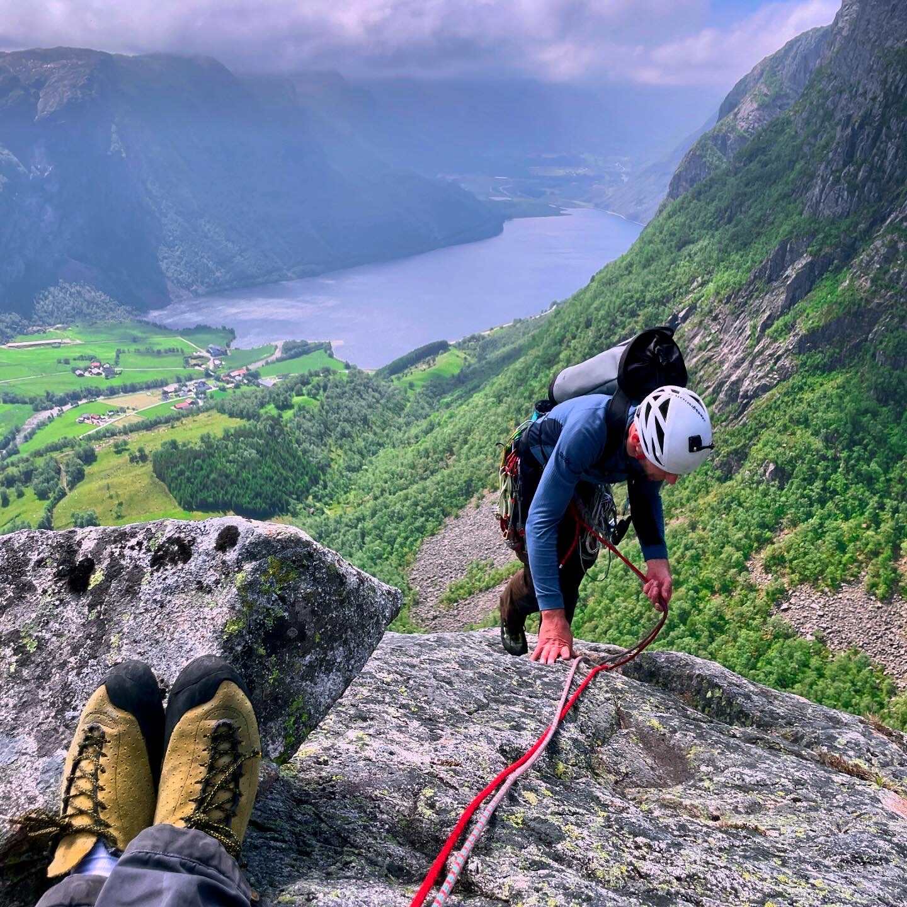

# Escalada na Noruega, região de Stavanger

    
    <em>Dirdalsvegen - fantástica parde de 250m com uma excelente seleção de vias em móvel</em>

A temporada de escalada em rocha na Noruega é da primavera, até cedo no outono, ie, mais ou menos de Março ou Abril até Setembro. Mas com uma janela de tempo certa ( e muita lã), pode-se escalar no inverno também. Alguns escaladores esportivos de ponta mandam projetos difíceis no inverno, pois a temperatura baixa e o ar seco aumenta o atrito dos dedos com a pedra 😉 E uma vantagme enorme de escalar montanha no verão são os dias longos – do final de Maio até meio de Agosto não fica escuro.

<em>Top rope solo no inverno - foto as 2 da tarde, Dale, 15min de Stavanger</em>

A maior parte da escalada aqui é em granito. O país inteiro tem um potencial enorme pra novas vias, tanto esportiva quanto de montanha.

A escalada de montanha têm uma ética especial: 100% em móvel. Qualquer via de mais de uma enfiada é considerada montanha, e não é aceito deixar nada na parede. Há poucas exceções a isso. Isso se deve ao fato de ter muita fenda e ótimas proteções. 

<em>Segunda enfiada da via Sleepwalk Crack, Heskestad Pillaren</em>

<em>Stetinden, via Normal - Narvik no note da Noruega</em>

Sobre escalada esportiva, o padrão é bastante seguro: chapeletas e parada dupla, sem lance expo. Com os clube locais responsáveis pela a manutenção. 

<em>Trellskår" title="Trellskår - nome da via: Queda Molhada ;)</em>

Há também uma modalidade muito interessante: escalada esportiva em móvel, ie, vias de até 30m, com parada dupla em cima, mas protegidas em móvel. Tem de todos os graus, de 3º a 10º. Um ótimo terreno pra treinamento de colocações antes de partir pra vias longas.

<em>Salmonsknuten - via longa, montanha alpina e bem acessível</em>

Aqui na região de Stavanger, pra escalar esportiva por aqui, qualquer nível de escalador vai encontrar opções. Mas pra fazer montanha, as paredes são íngremes os graus são puxados, é preciso está guiando sólido um 6+ em móvel pra aproveitar a viagem. Mais no centro do país, no Parque Nacional Jotunheim, e ao Norte, Lofoten, Narvik, Tromso, tem montanhas mais “alpinas”, com vias normais mais fáceis, mas com frequência aproximação por geleira. 

<em>Dirdalsvegen, P3 da via Confortably Numb</em>

<em>Skeisfjell</em>

